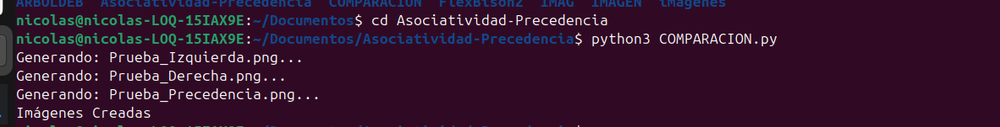
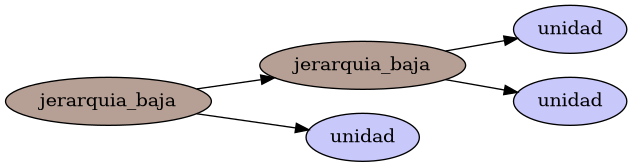
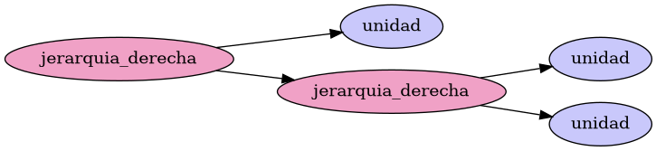
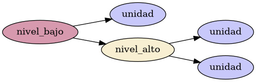

# Asociatividad-Precedencia

**INTRODUCCION**

Este proyecto muestra cómo diseñar gramáticas no ambiguas para procesar expresiones matemáticas y lógicas. El objetivo es controlar el orden de las operaciones mediante la estructura de las reglas (estratificación), asegurando que el código se interprete correctamente.

Utilizo Lark en Python para construir el analizador y Graphviz para generar los árboles de derivación. Estos diagramas permiten ver cómo los operadores de mayor prioridad se "hunden" en la base del árbol, mientras que la recursividad (izquierda o derecha) define cómo se agrupan los datos.

**COMO EJECUTARLO**

PASO 1-Instalacion de la libreria utilizada. Es necesario tener instalado Python 3.x y el software Graphviz en el sistema. Puedes instalar las dependencias de Python con el siguiente comando:

```bash
  pip install lark pydot
```

PASO 2-ejecutar el programa

```bash
python3 COMPARACION.py
```

**DESCRIPCION DEL CODIGO**

El proyecto usa una técnica llamada estratificación, que consiste en organizar la gramática en capas. Esto permite que el analizador sepa exactamente qué operación va primero: los operadores de mayor prioridad se colocan en las reglas más profundas, mientras que los de menor prioridad se quedan cerca del inicio.

Para el procesamiento, el script utiliza Lark con un análisis ascendente. La dirección en la que la regla se llama a sí misma (recursividad) es la que define la asociatividad: si se llama por la izquierda, los datos se agrupan en ese orden, y si lo hace por la derecha, se agrupan hacia el final, como ocurre con la potencia.

Finalmente, el código convierte estos procesos internos en imágenes PNG usando Graphviz. Estos árboles visuales son la prueba de que la gramática no es ambigua y que el compilador está interpretando la jerarquía y el agrupamiento de los operadores tal como se planeó.

**RESULTADOS Y PRUEBAS**

**Ejecucion en consola**

Al ejecutar el script, la consola actúa como un registro de control que confirma el procesamiento de cada gramática. Verás mensajes en tiempo real indicando qué prueba se está analizando y el nombre exacto del archivo .png que se ha generado. Si existe algún error en la sintaxis de la cadena de entrada, la consola lo notificará inmediatamente, lo que permite validar que el analizador LALR está funcionando correctamente antes de revisar las imágenes.



**Grafica 1 asociatividad por izquierda**

El árbol hacia la izquierda

Esta prueba muestra cómo el analizador agrupa los términos de izquierda a derecha, que es lo normal en sumas o restas. En el gráfico verás que la operación que está más a la izquierda se "hunde" más en el árbol, obligando al sistema a resolverla primero.



**Grafica 2 asociativiad hacia la derecha**

Aquí validamos el caso opuesto, típico de potencias o asignaciones. La estructura del árbol se inclina hacia el final de la expresión, lo que significa que el proceso de evaluación empieza desde la derecha y regresa hacia el inicio.



**Grafica 3 Mixtas Precedencia**

Esta es la prueba de fuego para la estratificación. Al combinar diferentes operaciones (como una suma y una multiplicación), el árbol muestra que la regla de mayor jerarquía se "hunde" hacia las ramas más bajas. Esto garantiza que el analizador resuelva primero lo que está más profundo en el árbol antes de subir a los niveles superiores, respetando siempre el orden matemático correcto.



**Analisis grafica**

El análisis visual de los árboles confirma que la estratificación funciona correctamente. En la gráfica de precedencia, se observa que el nivel_alto (multiplicación) se ubica físicamente por debajo del nivel_bajo (suma). Esto obliga al sistema a resolver primero las operaciones en las ramas más profundas antes de subir el resultado hacia la raíz, garantizando que el orden matemático se respete siempre.

Respecto a la asociatividad, la estructura del árbol muestra cómo la dirección de la recursividad inclina las ramas. Cuando el árbol se recuesta hacia la izquierda, los operadores se agrupan secuencialmente desde el inicio; por el contrario, en operadores como la potencia, la ramificación hacia la derecha demuestra que la evaluación comienza desde el último término hacia atrás.

Finalmente, los nodos de unidad actúan como la base de toda la estructura. Al ser los elementos más profundos, aseguran que el analizador identifique primero los valores básicos antes de operar. Este diseño permite que, al usar paréntesis, una expresión completa se desplace al fondo del árbol, adquiriendo prioridad absoluta sobre cualquier otra regla de la gramática.


**CONCLUSIONES**

El desarrollo de este proyecto permite validar que la estructura de una gramática es el "contrato" que define el comportamiento de un lenguaje. Al implementar la estratificación, logramos que el analizador jerarquice las operaciones de forma automática, eliminando cualquier ambigüedad sin necesidad de reglas externas complejas. Esto demuestra que la precedencia no es una configuración arbitraria, sino una consecuencia directa de la profundidad de las reglas en el diseño BNF.

Asimismo, el uso de herramientas de visualización como Graphviz resulta fundamental para la auditoría de compiladores. Poder observar la inclinación del árbol (hacia la izquierda o derecha) nos da una prueba empírica de la asociatividad de los operadores. En conclusión, una gramática bien diseñada garantiza que el flujo de datos sea predecible, eficiente y, sobre todo, fiel a las reglas lógicas y matemáticas que el programador desea implementar.
